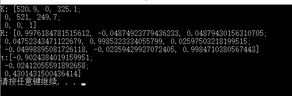

Binocular Calibration
======================
A uncompleted project for binocular self calibration.

Goal
-----
Given two images and camera intrinsic parameters, get the camera pose.

Procedure
---------
* get the matched feature points;
* find fundamental matrix;
* find essential matrix;
* recover camera pose by using svd decompose.

Data
----
 

Result
-------
