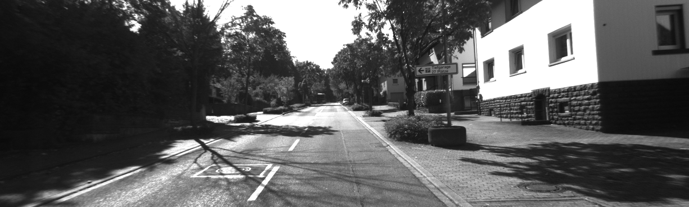
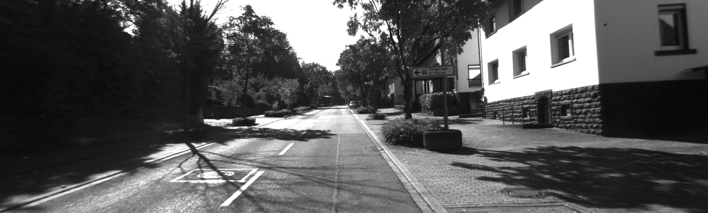
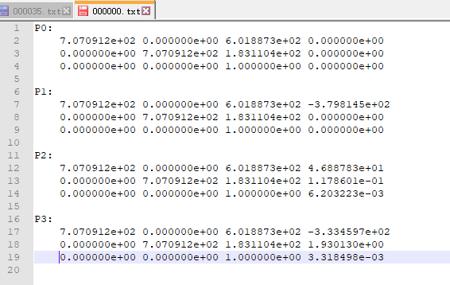

Camera Pose
======================
A project for finding and optimizing rotation matrix and translation matrix of camera pose.

Goal
-----
Given two images and camera intrinsic parameters, get the camera pose.

Procedure
---------
* get the matched feature points;
* find fundamental matrix;
* find essential matrix;
* recover camera pose by using svd decompose essential matrix;
* find the right rotation matrix and translation matrix by triangulation;
* optimize rotation matrix and translation matrix by using ceres.

Data
----
 

Calibration
-----------

Result
-------

Question
--------
这里选取了kitti数据集中两个灰度相机拍摄的第10帧图像，其相机的标定结果见Calibration，前三列应该为相机内参数，第四列应该为相机之间的位置差距，从第四列可以看出，两个灰度相机和两个彩色相机之间的位置差距只有x方向有位移，其他方向几乎忽略不计，但是从结果图中可以看出，svd分解得到的R,t，R接近于单位矩阵E，而t乘以任意比例因子都无法做到和标定结果相近似，这是问题所在。另外，将kitti所有color和灰度图像都测试了，也是和前面一样的结果。

Confused(Clear)
---------------
* Question: What is our goal? Self calibration or optimize K,R,t? Or both?
* Answer: Given two images and camera intrinsic parameters, find optimized the camera pose.
* Question: May need svd decompose in order to get epipolar points by **Fe=0**, but hard to do in template function for epipolar optimizing.
* Answer: Needn't.
* Optimal solution can be done through soluting an equation fo higher degree, or may be caught in local minumum by iteration search for getting the spatial points.
* Answer: We don't use optimal solution but reprojection solution.
