原始图像
--------
左
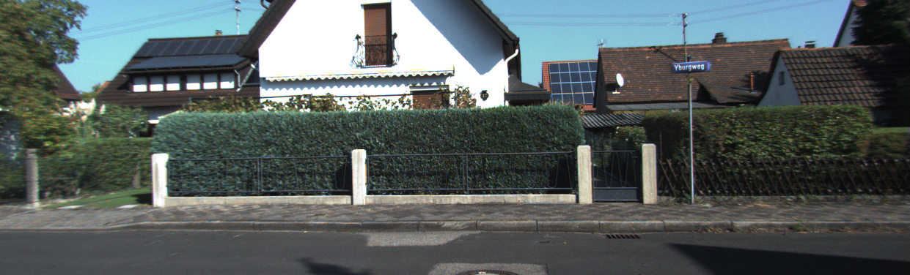

右

真值
----
我找不到，大部分只给了相机标定参数和左右图像，姿态需要自己求。

人为给定R,t
-----------
相机姿态R，T
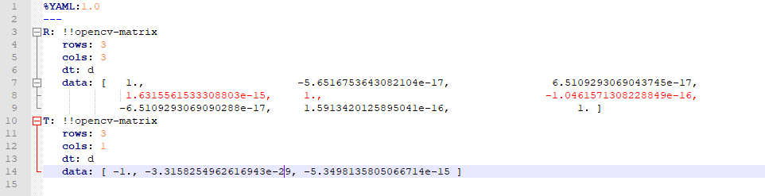

矫正图左

矫正图右边
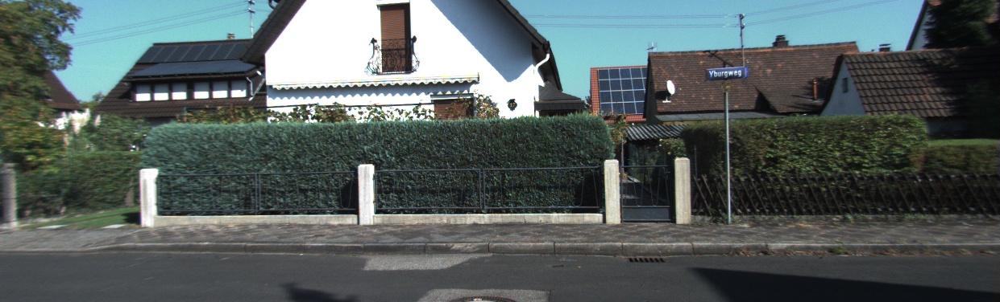

视差图
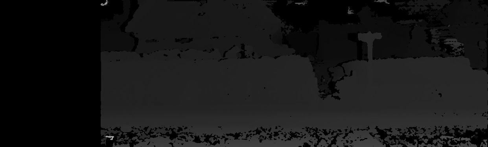

本质矩阵分解
------------
相机姿态R，T
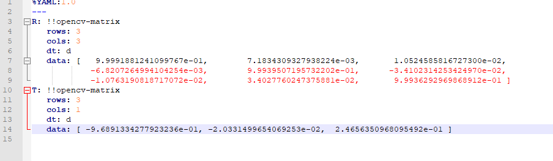

矫正图左
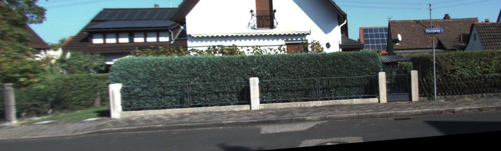

矫正图右边
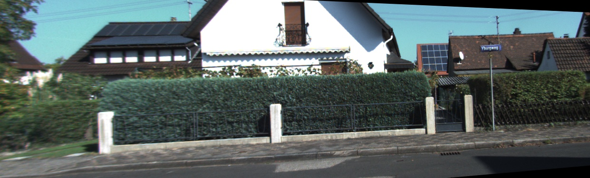

视差图
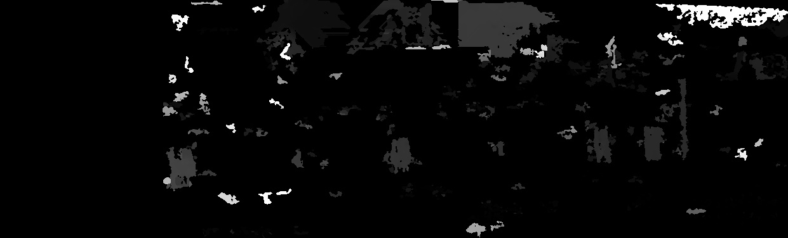

优化1
-----
相机姿态R，T
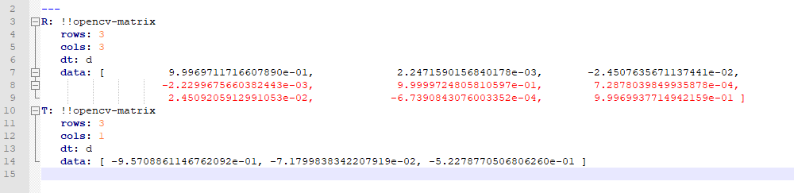

矫正图左
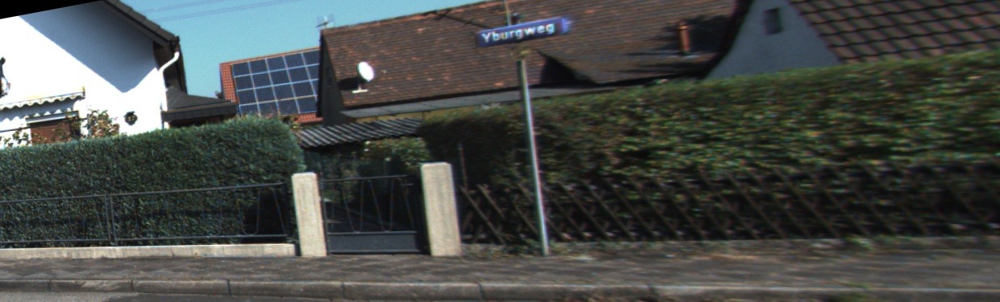

矫正图右边
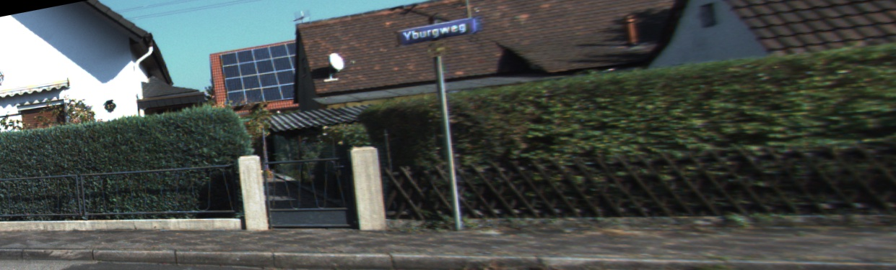

视差图
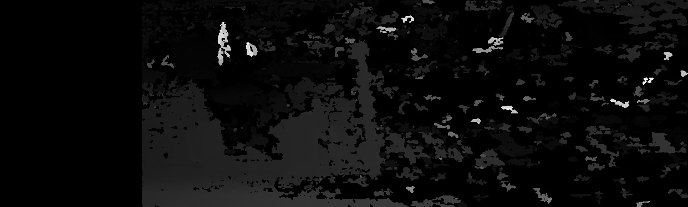

相关的代码全是引用别人已经出版了的，除了优化部分，优化部分的目标函数是一点到另一点的极线的垂直距离，我能做的只有这么多了。