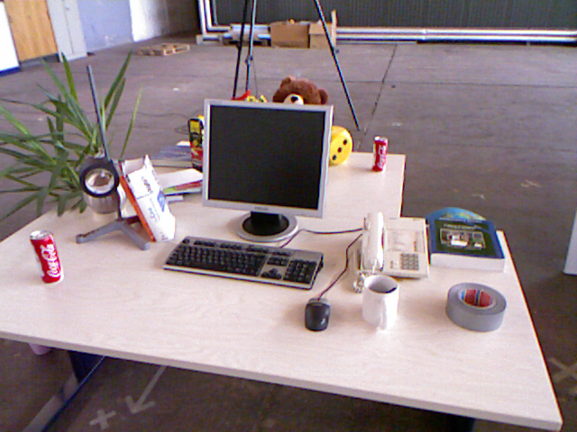

Camera Pose
======================
A project for finding and optimizing rotation matrix and translation matrix.

Goal
-----
Given two images and camera intrinsic parameters, get the camera pose.

Procedure
---------
* get the matched feature points;
* find fundamental matrix;
* find essential matrix;
* recover camera pose by using svd decompose essential matrix;
* find the right rotation matrix and translation matrix by triangulation;
* optimize rotation matrix and translation matrix by using ceres.

Data
----
 

Result
-------

Confused(Clear)
---------------
* Question: What is our goal? Self calibration or optimize K,R,t? Or both?
* Answer: Given two images and camera intrinsic parameters, find optimized the camera pose.
* Question: May need svd decompose in order to get epipolar points by **Fe=0**, but hard to do in template function for epipolar optimizing.
* Answer: Needn't.
* Optimal solution can be done through soluting an equation fo higher degree, or may be caught in local minumum by iteration search for getting the spatial points.
* Answer: We don't use optimal solution but reprojection solution.
