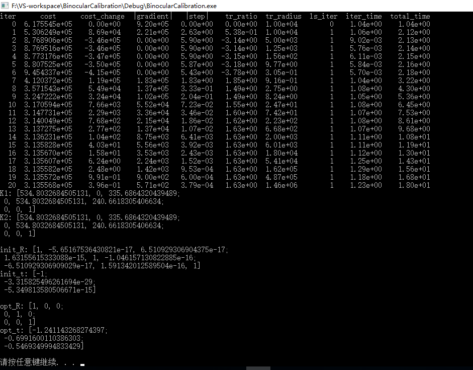

Camera Pose
======================
A project for finding and optimizing rotation matrix and translation matrix of camera pose.

Task
----
双目立体视觉求深度信息在图像矫正之后，此时就相当于两个光轴平行并且在同一条直线上的相机观察物体。深度信息对于每一个相机都是一样的，如图所示：

根据Data数据利用SGBM求得的视差可视化图如下：

求得的深度可视化图如下：

SGBM代码如下：
```
#include <opencv\cv.hpp>
#include <opencv2\opencv.hpp>
using namespace std;
using namespace cv;


int main(int argc, char * argv[])
{
	Mat left = imread("../Debug/img0_000000_10.png", IMREAD_GRAYSCALE);
	Mat right = imread("../Debug/img1_000000_10.png", IMREAD_GRAYSCALE);
	Mat disp;
	int mindisparity = 0;
	int ndisparities = 64;
	int SADWindowSize = 11;
	//SGBM
	cv::Ptr<cv::StereoSGBM> sgbm = cv::StereoSGBM::create(mindisparity, ndisparities, SADWindowSize);
	int P1 = 8 * left.channels() * SADWindowSize* SADWindowSize;
	int P2 = 32 * left.channels() * SADWindowSize* SADWindowSize;
	sgbm->setP1(P1);
	sgbm->setP2(P2);
	sgbm->setPreFilterCap(15);
	sgbm->setUniquenessRatio(10);
	sgbm->setSpeckleRange(2);
	sgbm->setSpeckleWindowSize(100);
	sgbm->setDisp12MaxDiff(1);
	//sgbm->setMode(cv::StereoSGBM::MODE_HH);
	sgbm->compute(left, right, disp);
	disp.convertTo(disp, CV_32F, 1.0 / 16);                //除以16得到真实视差值
	Mat disp8U = Mat(disp.rows, disp.cols, CV_8UC1);       //显示
	normalize(disp, disp8U, 0, 255, NORM_MINMAX, CV_8UC1);
	imwrite("SGBM_DiparityMap.jpg", disp8U);

	Mat deepth;
	disp.copyTo(deepth);
	/* 
	P0: 7.188560e+02 0.000000e+00 6.071928e+02 0.000000e+00 
		0.000000e+00 7.188560e+02 1.852157e+02 0.000000e+00 
		0.000000e+00 0.000000e+00 1.000000e+00 0.000000e+00

	P1: 7.188560e+02 0.000000e+00 6.071928e+02 -3.861448e+02 
		0.000000e+00 7.188560e+02 1.852157e+02 0.000000e+00 
		0.000000e+00 0.000000e+00 1.000000e+00 0.000000e+00

	P2: 7.188560e+02 0.000000e+00 6.071928e+02 4.538225e+01 
		0.000000e+00 7.188560e+02 1.852157e+02 -1.130887e-01 
		0.000000e+00 0.000000e+00 1.000000e+00 3.779761e-03

	P3: 7.188560e+02 0.000000e+00 6.071928e+02 -3.372877e+02 
		0.000000e+00 7.188560e+02 1.852157e+02 2.369057e+00 
		0.000000e+00 0.000000e+00 1.000000e+00 4.915215e-03

	deep = b * f / disp;
	*/
	deepth = 3.861448e+02 * 7.188560e+02 / disp;            //除以16得到真实视差值
	Mat deep8U = Mat(disp.rows, disp.cols, CV_8UC1);       //显示
	normalize(deepth, deep8U, 0, 255, cv::NormTypes::NORM_MINMAX, CV_8UC1);
	imwrite("SGBM_Deepth.jpg", deep8U);
	return 0;
}
```

Goal
-----
Given two images and camera intrinsic parameters, get the camera pose.

Procedure
---------
* get the matched feature points;
* find fundamental matrix;
* find essential matrix;
* recover camera pose by using svd decompose essential matrix;
* find the right rotation matrix and translation matrix by triangulation;
* optimize rotation matrix and translation matrix by using ceres.

Data
----
 

Calibration
-----------


Result
-------


Question
--------
这里选取了kitti数据集中两个灰度相机拍摄的第10帧图像，其相机的标定结果见Calibration，前三列应该为相机内参数，第四列应该为相机之间的位置差距，从第四列可以看出，两个灰度相机和两个彩色相机之间的位置差距只有x方向有位移，其他方向几乎忽略不计，但是从结果图中可以看出，svd分解得到的R,t，R接近于单位矩阵E，而t乘以任意比例因子都无法做到和标定结果相近似，这是问题所在。另外，将kitti所有color和灰度图像都测试了，也是和前面一样的结果。

Confused(Clear)
---------------
* Question: What is our goal? Self calibration or optimize K,R,t? Or both?
* Answer: Given two images and camera intrinsic parameters, find optimized the camera pose.
* Question: May need svd decompose in order to get epipolar points by **Fe=0**, but hard to do in template function for epipolar optimizing.
* Answer: Needn't.
* Optimal solution can be done through soluting an equation fo higher degree, or may be caught in local minumum by iteration search for getting the spatial points.
* Answer: We don't use optimal solution but reprojection solution.
