图漾深度相机测试
================
相机样例
--------

内参数
------
左相机
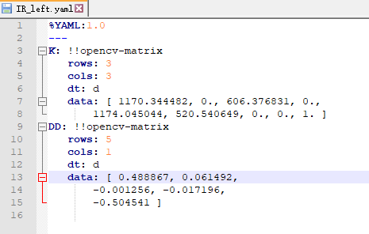

右相机
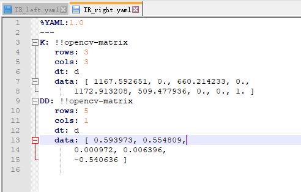

测试样例
--------
# 0
---
左图
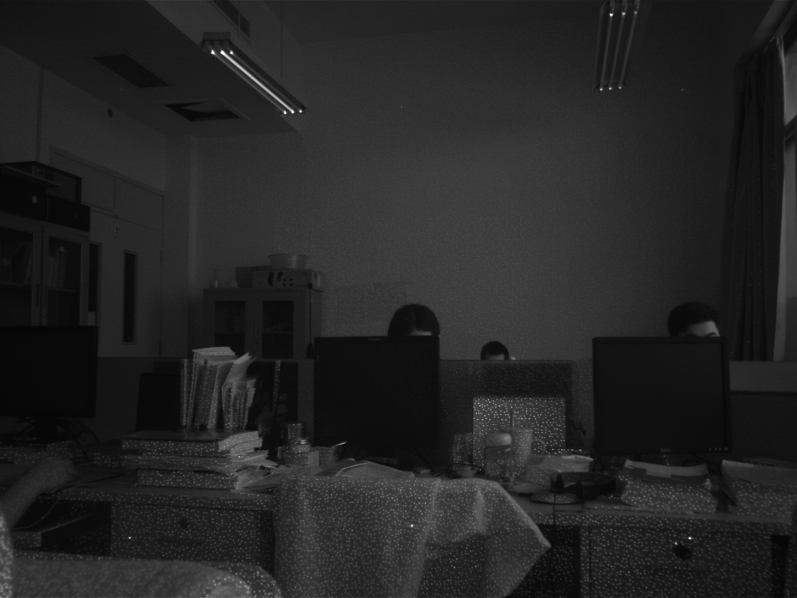

右图
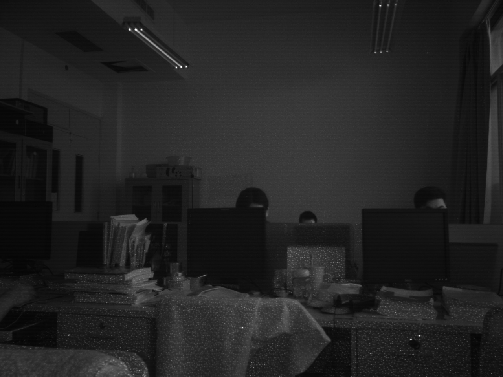

筛选特征点
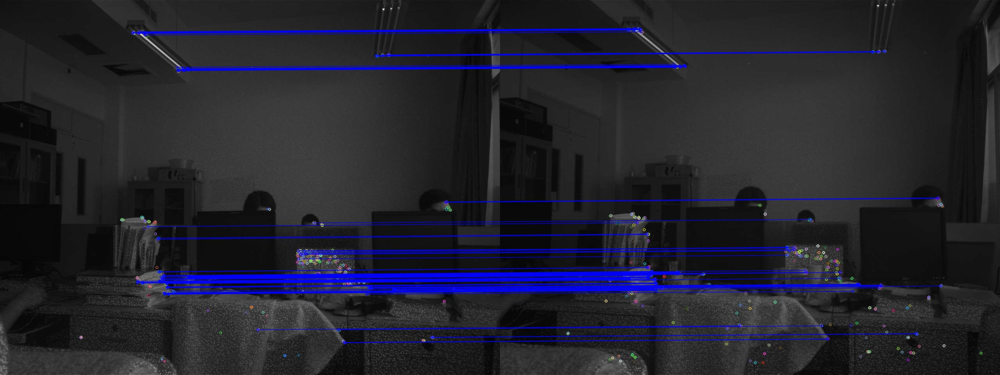

RANSAC掩码特征点
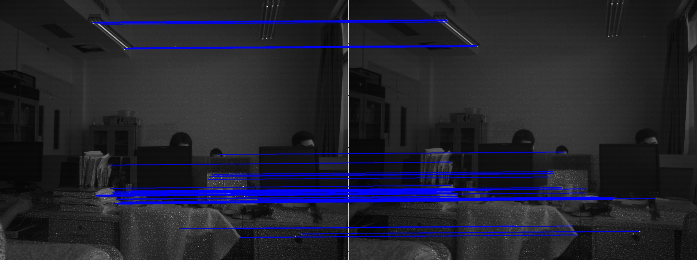

初始矫正
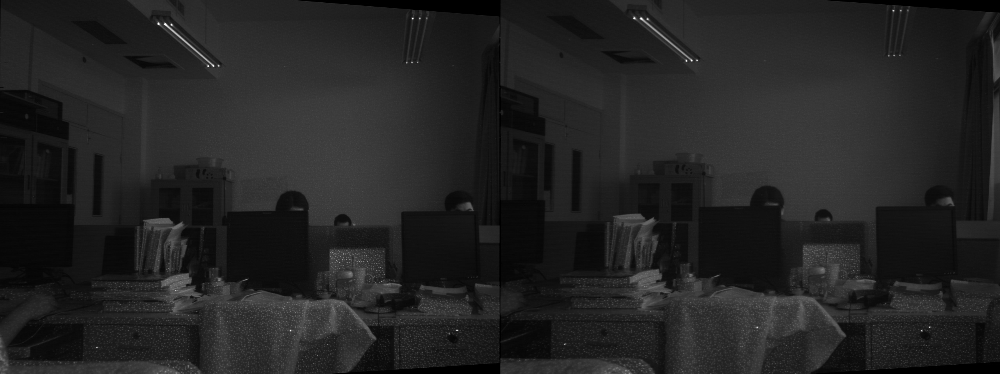

优化矫正
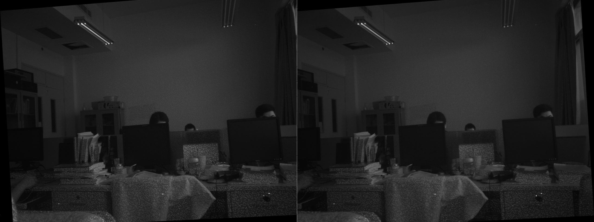

初始视差图
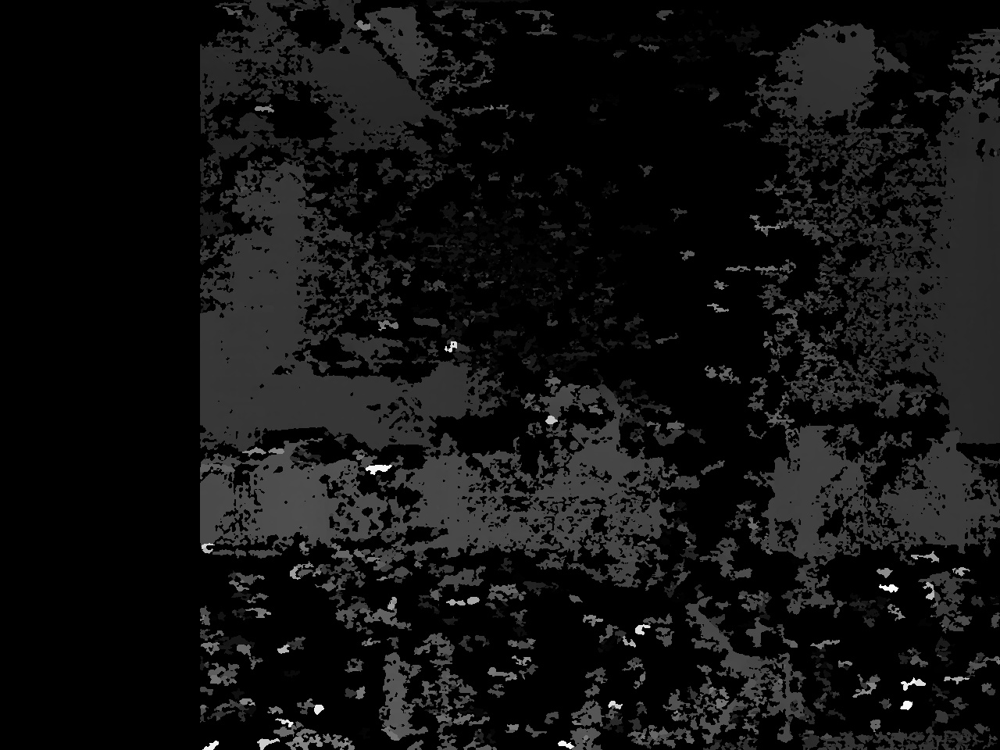

优化视差图
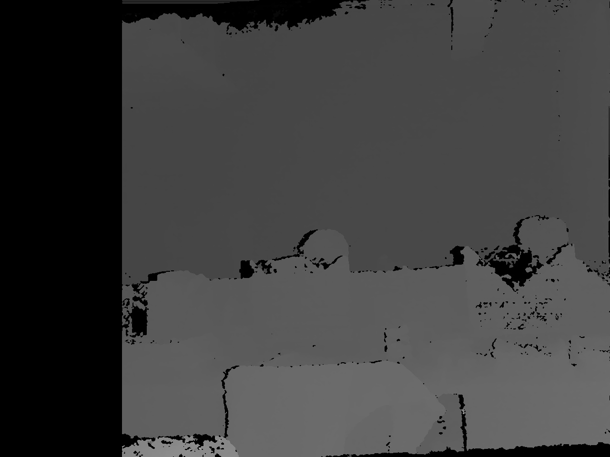

初始姿态
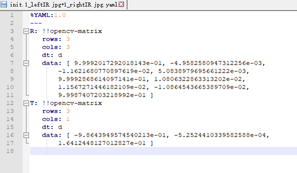

优化姿态

# 1
---
左图
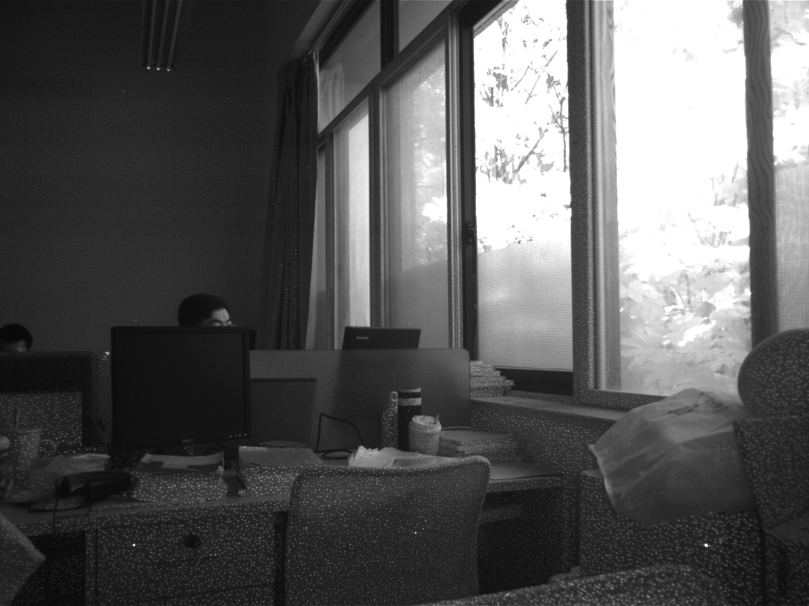

右图
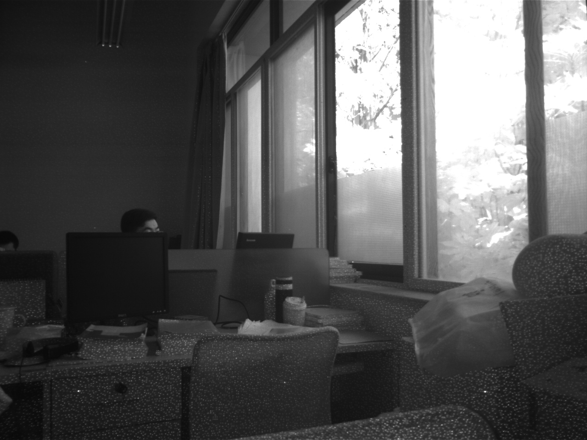

筛选特征点

RANSAC掩码特征点
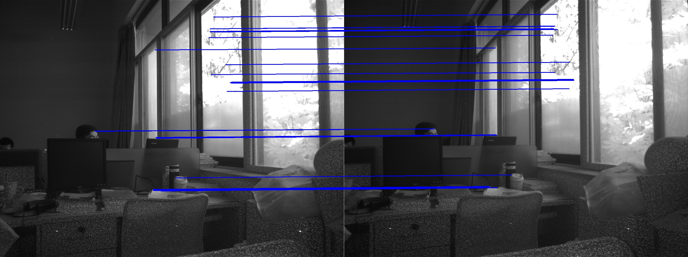

初始矫正

优化矫正
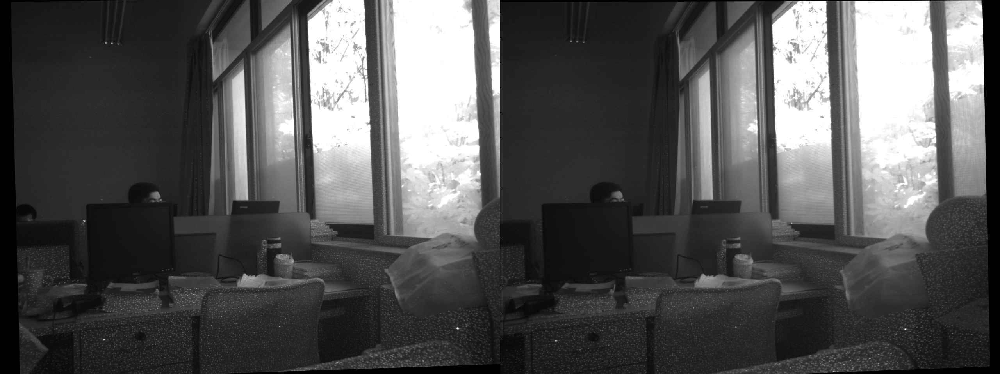

初始视差图

优化视差图
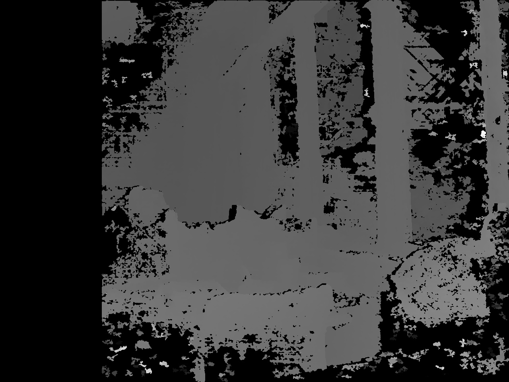

初始姿态

优化姿态

END.