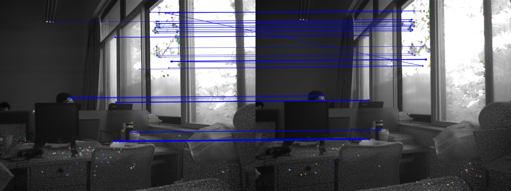
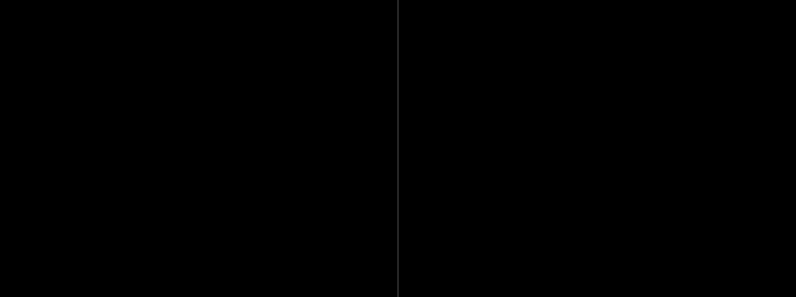

图漾深度相机测试
================
相机样例
--------

内参数
------
左相机

右相机

测试样例
--------

#3
---
左图

右图

筛选特征点

RANSAC掩码特征点

初始矫正

优化矫正

**加入畸变系数??** 原图看不出有畸变，而加入了畸变参数之后矫正图却明显看出了畸变（窗户）。

诊断：
* 畸变系数不正确？？
* 畸变模型不一样？？
* Opencv SGBM处理有误？？
* 有没有畸变无影响？？

图漾内置参数矫正图

初始视差图

优化视差图

图漾内置参数视差图

[INFO] Rate: 0.474768

[R | t]: 

	0.998988, -0.000726, -0.044964, -55.046494,

	0.000697,  1.000000, -0.000664, -0.151689,

    0.044965,  0.000632,  0.998988,  0.192080

运行结果

Matched points count: 58

[INFO] Init rate: 0.499437

[INFO] Opt rate: 0.880374

#2
---
左图

右图

筛选特征点

RANSAC掩码特征点

初始矫正

优化矫正

初始视差图

优化视差图

初始姿态

优化姿态

#1
---
左图

右图

筛选特征点

RANSAC掩码特征点

初始矫正

优化矫正

初始视差图

优化视差图

初始姿态

优化姿态

#0
---
左图

右图

筛选特征点

RANSAC掩码特征点

初始矫正

优化矫正

初始视差图

优化视差图

初始姿态

优化姿态

总结
----
本算法良好运行的前提条件是：
* 拍摄的图像清晰度较高，肉眼辨识度良好
* 避免背景单一

展望
----
* 提高算法的鲁棒性
* 适应低辨识度和背景单一的场景

END.