Camera Mode Parameter Optimization
====================================
An interface and an example of optimizing the camera intrinsic paramters, extrinsic paramters and distortion paramters which were estimated through a single planar image based on the fact that the planar points coordinate and the corresponding image points coordinate, and the principal point and image size were given was provided by this project.

List
----
* optimize.h: two function interfaces were provided.
* optimize.cpp: the realizing produce of two function interfaces.
* main.cpp: an example of the usage of this api.

Test Result
------------
No Noise Monitor Environment
----------------------------
True value:

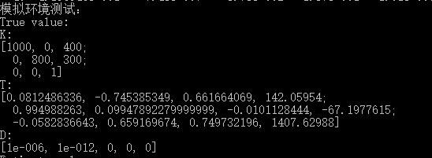

Estimated value:

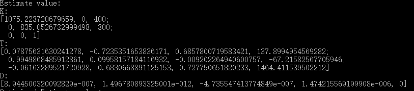

Optimized value:

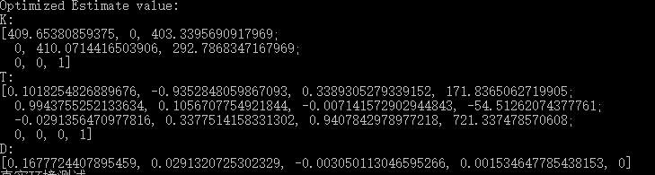

Real Environment
----------------------------
### 1st image
source image:

True value:

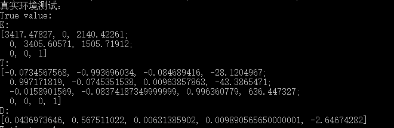

Estimated value:

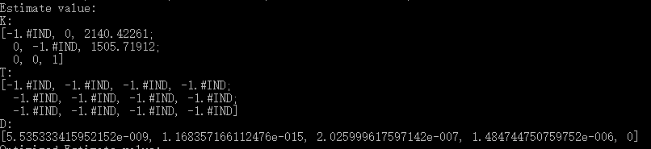

Optimized value:

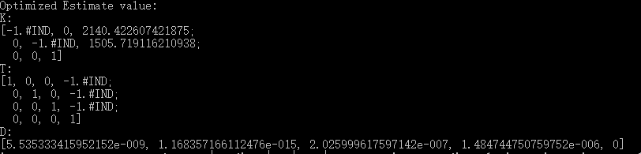

### 2nd image
source image: 

True value:

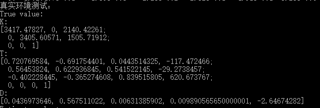

Estimated value:

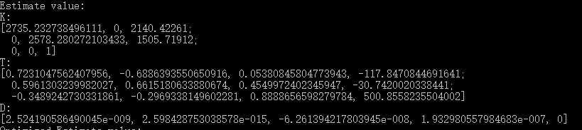

Optimized value:

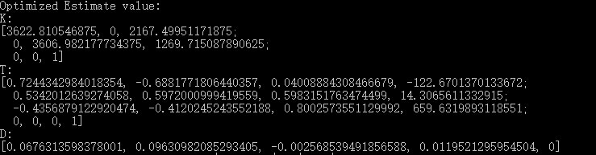

### 3rd image
source image: 

True value:

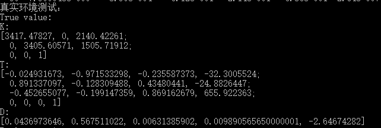

Estimated value:

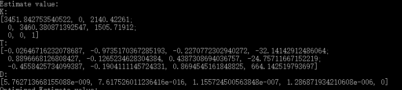

Optimized value:

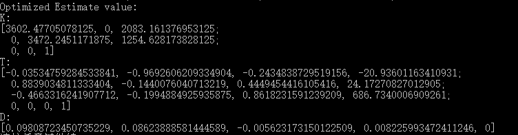

# Summary
From the test result, we can get the almost perfect estimated value but not good optimized value in the no noise monitor environment. Meanwhile, we got the bad estimated value and optimized value in 1st image and the not good estimated value and optimized value but the good estimated value and optimized value. Thus, we can merely get good estimated value and optimized value when the target points close to the principal point were enough.

